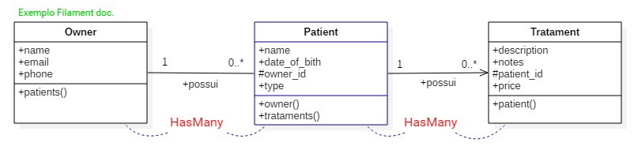
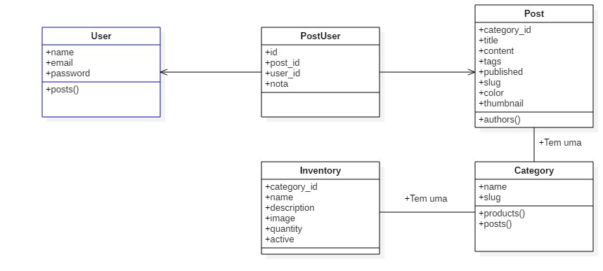
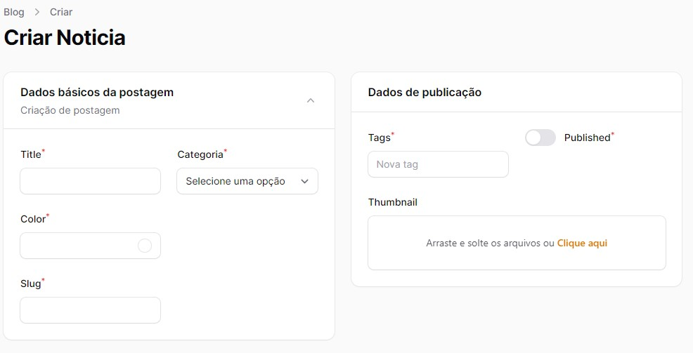
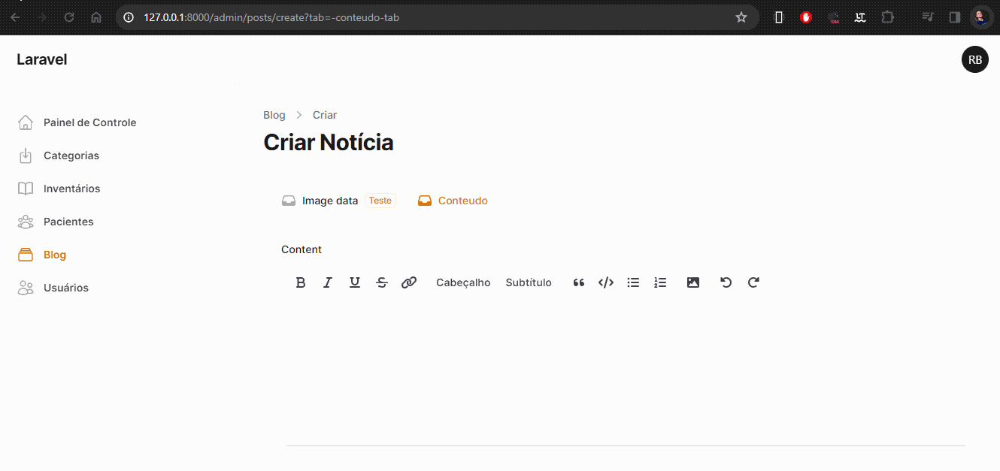
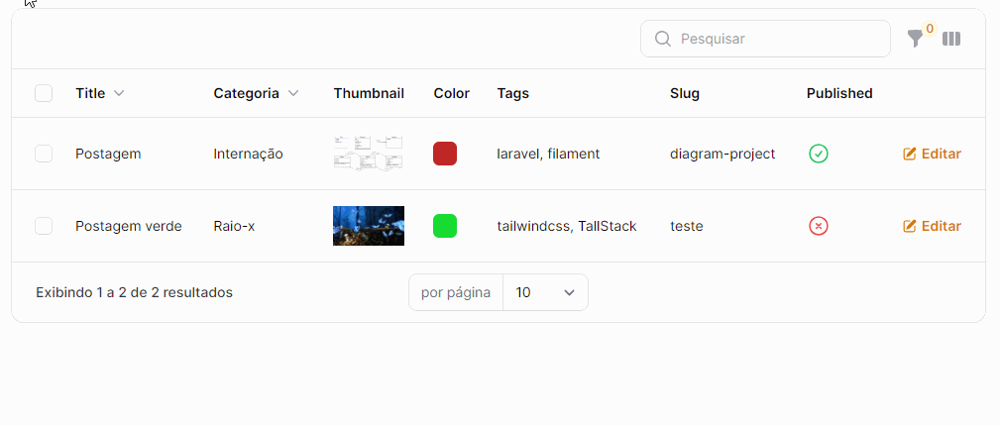

<p align="center"><a href="https://laravel.com" target="_blank"></a></p>

<p align="center">
	
    
    
    
	<a href="https://opensource.org/licenses/GPL-3.0">
		
	</a>
</p>

# 🚀 Demonstrando Filament 3 Tutorial - `Básico`

> O objetivo deste projeto é demonstrar e trabalhar com a nova versão desta coleção de componentes full-stack do laravel, o `Filament`.
>O filament é uma ótima opção se queremos acelerar o desenvolvimento, como a propria ferramente nos diz. A documentação é bem fácil de entender,
>e realmente traz uma enorme agilidade e rapidez no processo de desenvolvimento do projeto. 

Irei iniciar criando o projeto exemplo e no decorrer do desenvolvimento, passar por alguns pontos, com dicas, criar novas 
funcionalidades e formas de personalizar. Não vou passar tudo sobre a tecnologia, pois a documentação do Filament é intuitiva de aprender.

- [Site Filament laravel](https://filamentphp.com/).
- [Get started Filament](https://filamentphp.com/docs).
- [Panel Builder Installation](https://filamentphp.com/docs/3.x/panels/installation).

> Este projeto de exemplo irá abordar o exemplo que o próprio  `Filament` gera como exemplo em sua `página de panels` e vamos 
> incluir um `sistema de estoque` simples.

#### Descrição dos projetos `exemplo`
>`Exemplo | Filament`: A construção de um sistema simples de gerenciamento de pacientes para uma clínica veterinária usando o Filament. 
>Apoiará a adição de novos `pacientes` (gatos, cães ou coelhos), atribuindo-os a um `proprietário` e registrando quais 
>`tratamentos` eles receberam. O sistema terá um painel com estatísticas sobre os tipos de pacientes e um gráfico com a 
>quantidade de tratamentos administrados no último ano.

<p align="center">
	<a href="#"  target="_blank" title="Diagrama">
		
	</a>
</p>

#### :gem: Diagrama novo do projeto
> Descrição de casos...

<p align="center">
	<a href="#"  target="_blank" title="Diagrama">
		
	</a>
</p>

## :label: Config. database, migrate, models, etc.

#### 💥 Projeto Inventário de estoque
> Criando as migrates e models

```
php artisan make:model Inventory -m
php artisan make:model Poost -m
php artisan make:model Category -m
```


#### :ok_hand: Propriedades das `Migrations` [documentação laravel migrations table](https://laravel.com/docs/7.x/migrations)
> Vou demonstrar duas formas de relacionamento na migration, com os `exemplos` em Inventories e Post e na Category se mantém para as duas formas.

~~~~~~
    Schema::create('inventories', function (Blueprint $table) {
        $table->id();
        $table->string('name');
        $table->string('description');
`        $table->string('image');
        $table->integer('quantity');
        $table->foreignIdFor(\App\Models\Category::class);
        $table->timestamps();
    });

    Schema::create('categories', function (Blueprint $table) {
        $table->id();
        $table->string('name');
        $table->string('slug')->unique();
        $table->timestamps();
    });
~~~~~~

- OBs: Se não tem certeza com a chave, `category_id` ou qualquer outra chave, podemos usar a função `foreignIdFor` e 
passar a classe Eloquent, que automaticamente irá criar a coluna com o `nome da classe` e `_id`.

~~~~~~
    Schema::create('posts', function (Blueprint $table) {
        $table->id();
        $table->string('thumbnail')->nullable();
        $table->string('title');
        $table->string('color');
        $table->string('slug')->unique();
        $table->foreignId('category_id')->constrained()->cascadeOnDelete();
        $table->text('content')->nullable();
        $table->json('tags')->nullable();
        $table->boolean('published')->default(false);
        $table->timestamps();
    });
~~~~~~


#### Adicionando nova coluna `active` no inventario

```
php artisan make:migration alter_inventory_table_add_active_column --table=inventories
```

~~~~~~
    Schema::table('inventories', function (Blueprint $table) {
        $table->boolean('active')->default(true);
    });
~~~~~~

#### :ok_hand: Relacionamento das models. 
Estes são os metodos de relacionamento que iremos utilizar na relação `HasMany (1-1 & 1-M)`

~~~~~~
    //Inventory and Post
    public function category()
    {
        return $this->belongsTo(Category::class);
    }

    //Category
    public function products()
    {
        return $this->hasMany(Inventory::class);
    }
~~~~~~

#### Configurando o disco de armazenamento e o diretório
##### O disco por padrão é o publico, mas podemos modificar para outro e também definir um diretorio.
> Para que a imagem do produto apareça de forma correta, temos que ativa o `storage link` e modificar logo apos no arquivo `.ENV`
>a linha de `APP_URL` para receber a base do app `=http://127.0.0.1:8000`.

```
    php artisan storage:link
```

```
    FileUpload::make('thumbnail')
        ->disk('public')
        ->directory('thumbnails')->columnSpanFull(),
```

## 🚀 Filament 💥 

#### O Filament tem uma serie de comandos próprios conforme abaixo, que vou deburgar e descrever meu entendimento no decorrer deste projetinho. 

- make:filament-page              Create a new Filament page class and view
- make:filament-panel             Create a new Filament panel
- :boom: make:filament-relation-manager  :heavy_check_mark: O Filament permite que possamos gerenciar relacionamentos em nosso app. | [documentation](https://filamentphp.com/docs/3.x/panels/resources/relation-managers)
    - Os relacionamentos que podem ser gerenciados são `HasMany`, `HasManyThrough`, `BelongsToMany`, `MorphMany` e `MorphToMany`.
    > :heavy_check_mark: Os gerenciadores de relacionamento são tabelas interativas que permitem aos administradores listar, criar, anexar, associar, editar, desanexar, dissociar e excluir registros relacionados sem sair da página Editar ou Visualizar do recurso.
- :boom: make:filament-resource          :heavy_check_mark: Cria o arquivo de `resources` do seu modelo em App/Filament e cria toda estrutura das classes padrão.
    - Qualquer `model` que você criar em seu projeto laravel, podemos criar os Filaments em nosso projeto e ter páginas ou modais.
- make:filament-theme             Create a new Filament panel theme
- make:filament-user              Create a new Filament user
- make:filament-widget            Create a new Filament widget class

Criando as classes `views completas`| O `generate` irá add todas propriedades da sua migrate, criando páginas para seu projeto.

```
php artisan make:filament-resource Inventory --generate
php artisan make:filament-resource Post --generate
php artisan make:filament-resource User --generate
```

> Opção: Você pode criar de forma simples, views `simplificadas com MODAIs` no lugar de um página, como editar ou criar.

```
php artisan make:filament-resource Inventory --simple --generate
```

### :bulb: Relacionamento (1-1 & 1-M) `BelongsTo` e `HasMany`
Com os metodos de relacionamento criados nos models `BelongsTo` e `HasMany`, vamos add na view de `InventoryResource`, 
o relacionamento _*relationship*_ e ele tem dois argumentos.

> O primeiro argumento é o _nome do metodo_ no modelo e segundo a _proriedade_ que mostra.

~~~~~~
   Select::make('category_id')->relationship('category', 'name')
~~~~~~

### :bulb: Adicionar o Gerenciador de relacionamento
Para adiconar este gerenciador, utilizamos o comando abaixo e mais agluns argumentos como qual `resource` você quer gerenciar,
(Ex.: `CategoryResource`), segundo é o nome do relacionamento em sua model (Ex.: posts) e por último qual propriedade da model quer usar (title).

~~~~~~
php artisan make:filament-relation-manager CategoryResource posts title
~~~~~~

> O filament irá criar um outro diretorio em App/Filament/Resources/CategoryResource/RelaionManagers. chamado de PostsRelationManager.php.
> Esta mesma é o complemento da categoria, mostrando os relacionamentos que a categoria tem com seus posts, mas antes disso, como a propria documentação
>do Filament informa, precisamos dizer qual seu relacionament no metodo getRelations da CategoryResource.

~~~~~~
    public static function getRelations(): array
    {
        return [
            RelationManagers\PostsRelationManager::class
        ];
    }
~~~~~~


#### :zap: Validation | [documentation](https://filamentphp.com/docs/3.x/forms/validation)
Abaixo um exemplo dos `diversos metodos de validação dedicados` que o Filament inclui, mas você também pode usar 
quaisquer outras regras de validação do Laravel, incluindo regras de validação personalizadas.

~~~~~~
    TextInput::make('title')->required()
        ->alpha()
        ->doesntStartWith(['admin'])
        ->rules(['min:3|max:30', 'alpha'])
        ->in(['test', 'hello'])
~~~~~~

> Algo interessante que o Filament nos proporciona, é poder adiconar outras regras de validação proprias ou usar as validações
>que o proprio laravel disponibiliza | [documentation](https://laravel.com/docs/10.x/validation#available-validation-rules). 


### :bulb: Many-to-many relationships 
Nesta relação vamos ter uma `tabela pivo` que irá guardar os IDs de relação entre `User e Post`, assim vamos poder 
visualizar e gerenciar quais `autores` temos em cada `postagem`. E aqui vamos criar a relação, que terá como ser definida no
formulário de criação do post, mas também vamos criar o gerenciamento que o Filament permite criar.

:speech_balloon: Criação da tabela pivo como o `php artisan make:model post_user -m`.
~~~~~~
    Schema::create('post__users', function (Blueprint $table) {
        $table->id();
        $table->foreignIdFor(\App\Models\Post::class);
        $table->foreignIdFor(\App\Models\User::class);
        $table->timestamps();
    });
~~~~~~

:speech_balloon: Em User e Post criamos os `metodos` para relação.
~~~~~~
    //USER
    public function posts()
    {
        return $this->belongsToMany(Post::class, 'post__users')->withTimestamps();
    }

    //POST
    public function authors()
    {
        return $this->belongsToMany(User::class, 'post__users')->withTimestamps();
    }
~~~~~~

:speech_balloon: Em `PostResource` teremos `duas formas` de mostrar, multiple com `multiplos autores` (Array) e `CheckboxList autores`.

~~~~~~
        Select::make('authors casa')
            ->label('Autores')
            ->multiple()
            ->preload()
            ->relationship('authors', 'name'),

        Forms\Components\CheckboxList::make('authors casa')
            ->label('Autores')
            ->searchable()
            ->relationship('authors', 'name'),
~~~~~~


#### :construction: Gerenciamento dos autores
:speech_balloon: Agora vamos ao `filament-relation-manager` onde vamos criar o gerenciamento dos autores dos post, onde 
vamos poder adicionar novos autores ou vincular autores já cadastrados.

~~~~~~
    php artisan make:filament-relation-manager PostResource authors name
~~~~~~

:speech_balloon: Adicionando o RelationMangers de `AuthorRelationManger` na class PostResource.

~~~~~~
    public static function getRelations(): array
    {
        return [
            RelationManagers\AuthorsRelationManager::class
        ];
    }
~~~~~~

#### Tabela Pivot

:speech_balloon: Ajustando os metodos de relação de Post e User add `->withPivot('nota')`

> Coluna adicionada na migrate pivo post
~~~~~~
    $table->integer('nota')->default(0);
~~~~~~

- php artisan migrate:refresh --step=1

~~~~~~
    //Post e User add.
    public function authors()
    {
        return $this->belongsToMany(User::class, 'post__users')->withPivot('nota')->withTimestamps();
    }
~~~~~~

:speech_balloon: Add em `AuthorRelationManger` o vinculo de autores ao posta e já definindo a nota.
~~~~~~
->headerActions([
    Tables\Actions\AttachAction::make()
        ->form(fn (AttachAction $action): array => [
        $action->getRecordSelect(),
        Forms\Components\TextInput::make('nota')->required(),
    ]),
])
~~~~~~

### Relações polimórficas (1-1 e 1-M) 
:speech_balloon: Essa relação polimórfica será criada para relação dos comentários dos usuários nas postagens. Então para isso vamos lá.

~~~~~~
    //Add migrate
    php artisan make:model Comment -m
~~~~~~

~~~~~~
    //Property in migrate comments
    Schema::create('comments', function (Blueprint $table) {
        $table->id();
        $table->foreignIdFor(\App\Models\User::class);
        $table->morphs('comentable');
        $table->string('comment');
        $table->timestamps();
    });
~~~~~~

#### :construction: Gerenciamento dos comentários
~~~~~~
    php artisan make:filament-resource Comment
~~~~~~


#### Layouts ( Section & Group, Tabs) 
Alguns detalhes/Dicas de `GRIDs` `Groups`, `Sections` com columns e columnSpans.

~~~~~~
    
    return $form->schema([
        RichEditor::make('content')->columnSpan(3) //ou 'full' ou ->columnSpanFull()
    ])->columns(3),

    Forms\Components\Grid::make()->schema([
        //...
    ])->columns(2),
    
    //Forms
    return $form
            ->schema([
                Section::make('Dados básicos da postagem')
                    ->description('Criação de postagem')
                    ->collapsible()
                    ->schema([
                    //..
                ])->columnSpan(1)->columns(2),

                Section::make('description')
                    ->schema([
                    //...
                ])->columnSpan(1)->columns(2),
    ])->columns([
          'default'   => 1,
          'md'        => 2,
          'lg'        => 2,
          'xl'        => 2,
      ]);
~~~~~~

> Com o `collapsible()` podemos fazer com que uma seção seja recolhida, usando o collapsed atributo. O `make("...")` e `description("...")`
>são titulo e subtitulo e `aside()` se adicionado, podemos alinha a div a esquerda.

<p align="center">
	<a href="#"  target="_blank" title="Diagrama">
		
	</a>
</p>

#### Tabs
As Guias ou `"Tabs"`, ajuda muito no front, por oferecer uma exibição de diversas telas em uma única guia.

~~~~~~
    Forms\Components\Tabs::make('Criar novo post')->tabs([
        Forms\Components\Tabs\Tab::make('Image data')->icon('heroicon-m-inbox')->schema([
            //...
        ]),
    
        Forms\Components\Tabs\Tab::make('Conteudo')->icon('heroicon-m-inbox')->schema([
            //...
        ])
    ])->columnSpanFull()->activeTab(1)->persistTabInQueryString(),
~~~~~~

<p align="center">
	<a href="#"  target="_blank" title="Diagrama">
		
	</a>
</p>


#### Filtros
Na tabela podemos adicionar filtros para todos tipos de propriedades que temos em nosso projeto e aqui vai dois exemplos.
> `Filter` aborda a propriedade booleana para ativos e não e a `TernaryFilter` aborda da mesma forma, mas simplificada. 
>E a `SelectFilter` temos o filtro por categoria utilizando o relacionamento.

~~~~~~
    ->filters([
        Filter::make('Posts ativos')->query(
            function (Builder $query): Builder {
                return $query->where('published', true);
            }
        ),
        TernaryFilter::make('published')->label('Filtro por publicados ou não')->default(true),
        SelectFilter::make('category_id')->label('Categorias')
            ->relationship('category', 'name')->preload()
            ->multiple()

    ])
~~~~~~

<p align="center">
	<a href="#"  target="_blank" title="Diagrama">
		
	</a>
</p>

~~~~~~
php artisan make:filament-widget PatientTypeOverview --stats-overview
php artisan make:filament-widget TreatmentsChart --chart

composer require flowframe/laravel-trend
~~~~~~
